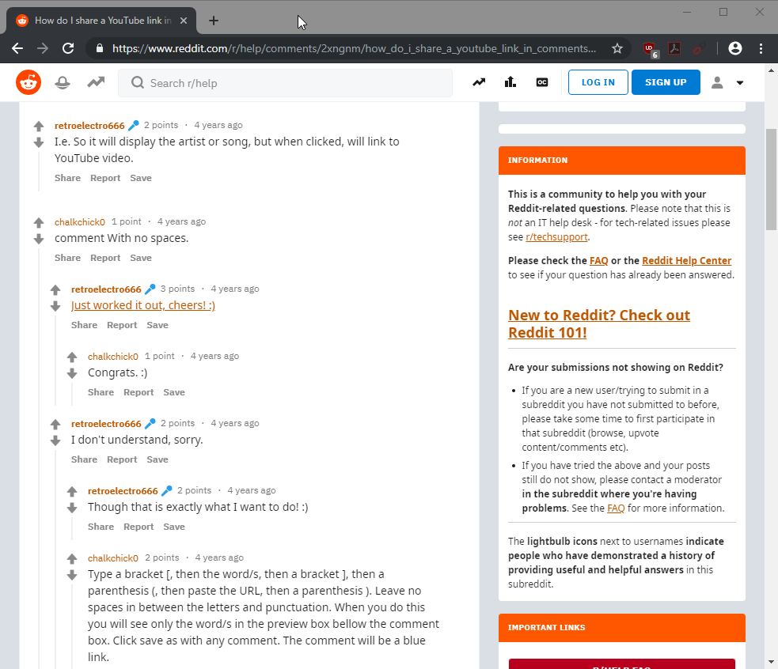

I recently switched from [YouTube](https://www.youtube.com/) to 
[YouTube Music](https://music.youtube.com) for my music needs. I made this
decision after realizing how much better the user experience on YouTube 
Music is, and also that I do not care for comments or any of other non-music
related features that YouTube has.

The only drawback to this decision was that it is not as easy to find newly
published Indian songs on YouTube Music as it is on YouTube. I can't just go to the
channels of the popular Indian music studios and see what's new - channels 
only exist on YouTube. I still have to go to YouTube to get that information, 
and then manually copy-paste the song or album name over to YouTube Music. 
I can't use Spotify either as it doesn't always get the latest songs or 
albums as fast as YouTube does.

**Solution**: Create a Chrome extension to redirect YouTube links to YouTube Music.
<!--more-->

To solve this problem, I looked into creating a Chrome extension. The first
hurdle was JavaScript - I only know the very basics of it. The second hurdle
was figuring out the project structure and how to get the required info 
from the YouTube URL and parse it to create and open the target YouTube 
Music URL. 

After about six
hours of reading through the [documentation](https://developer.chrome.com/extensions/getstarted)
and various posts on StackOverflow, I am relieved to present the 
"[YouTube to YouTube Music](https://github.com/kapoorlakshya/youtube2music)" 
extension for Chrome and Chromium based browsers.

### Installation

1. Clone the [`youtube2music`](https://github.com/kapoorlakshya/youtube2music) repository to your Desktop or wherever you want.
2. Launch Chrome and navigate to `chrome://extensions`.
3. Enable **Developer mode** in the top right.
4. Click on **Load unpacked…** on the left and select the cloned repository (folder) from step 1. 

You should now see the extension in the list.

### Usage

Navigate to YouTube, right click any music video, and click on 
**Open in YouTube Music** in the context menu.

Additionally, you can open all `youtube.com` or `youtu.be` links from 
any other website. The extension enables the link in the context 
menu (right click menu) only if the URL you clicked on has `youtube.com` 
or `youtu.be` in it. Otherwise, the extension stays hidden.

## "This video is not available" Error

Any video which is not categorized as "**Music**" is not available in YouTube Music, and will show a 
"**This video is not available**" error.

Feel free to create bug reports and request any features on 
[GitHub](https://github.com/kapoorlakshya/youtube2music/issues).

Thank you for reading!