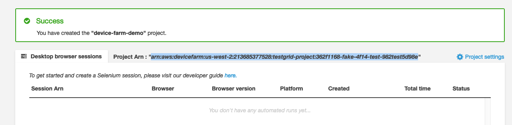

AWS Device Farm recently
[announced](https://aws.amazon.com/about-aws/whats-new/2020/01/aws-device-farm-announces-desktop-browser-testing-using-selenium/)
support for desktop browser testing using Selenium starting January 14, 2020. The desktop browser service appears to be
[very basic](https://docs.aws.amazon.com/devicefarm/latest/testgrid/techref-support.html) and has
[limitations](https://docs.aws.amazon.com/devicefarm/latest/testgrid/techref.html#techref-limitations) when
compared to [SauceLabs](https://saucelabs.com/) or [CrossBrowserTesting](https://saucelabs.com/), the other two
services that I have been evaluating as part of my role at [Wambi](https://wambi.org/).

Since the desktop browser service is fairly new, there is no [service](https://webdriver.io/docs/customservices.html)
available for it in WebdriverIO. So to make it work, you have to use the `aws-sdk` to generate the remote hub URL and then
use a custom test runner or a [launcher](https://webdriver.io/docs/clioptions.html#run-the-test-runner-programmatically)
to use it. The launcher is required because, based on my understanding, the current implementation of the `wdio` test
runner expects a top-level `config` object and this object does not allow us to integrate the async `aws-sdk` calls
inside it. The calls have to be made through the launcher and then passed down to the final `config`.

As part of my journey to learn Node.js, I have figured it all out and documented it in this post. I am hoping to
create a `wdio-device-farm-service` soon, but for now the following works well :).

 <!--more-->

> Note:
>
> 1. This guide assumes WebdriverIO v5 ([instructions](https://webdriver.io/docs/gettingstarted.html)) is already setup with tests ready
>    to be executed.
> 2. I am new to Node.js, so if you find any mistakes or think something can be improved, please feel free to email me. I appreciate
>    constructive criticism.

Okay! Let's do this!

### Steps

1. [Create a Device Farm project](#step-1)
2. [Generate a WebDriver (remote) Hub URL](#step-2)
3. [Configure WebdriverIO for remote execution](#step-3)
4. [Execute tests](#step-4)
5. [Create Grunt task (optional)](#step-5)

## 1. <a name="step-1"><a/>Create a Device Farm project

The first thing we need to do is create a new desktop browser project on Device Farm. This project is where our tests
will be executed and tracked. When we're done creating the project, we want to take note of the
Project [ARN](https://docs.aws.amazon.com/general/latest/gr/aws-arns-and-namespaces.html). The Project ARN is what
we'll use to create a WebDriver (remote) Hub URL in the next step so that our tests are executed under the correct
project.

To get started, log into your [AWS Device Farm console](https://console.aws.amazon.com/devicefarm) and click on "**Desktop browser testing projects**".
Now click on "**Create a new project**", fill in the project name, and click the "**Create project**" button.

Once the project is created, you'll see an unique **Project Arn**:



> Note: The ARN in the image is invalid and for this example only. Notice `fake` and `test` in it ;)

Copy this ARN and store it in a new environment variable of your choice. I am using `AWS_DF_ARN` for this post.

## 2. <a name="step-2"><a/>Generate a WebDriver (remote) Hub URL

In this step, we want to use the `aws-sdk` to create a WebDriver Hub URL using the Project ARN for your project. The
Device Farm API calls this the test grid URL and has the handy `createTestGridUrl()` function to generate it.

If you have not already, then install the `aws-sdk` using NPM or a package manager of your choice:

```bash
npm install aws-sdk
```

Now, either configure the AWS credentials by following these
[instructions](https://docs.aws.amazon.com/sdk-for-javascript/v2/developer-guide/getting-started-nodejs.html#getting-started-nodejs-credentials)
or simply pass them as parameters to `createTestGridUrl()`, like I do in the code below.

Next, we want to create an `async` function called `getTestGridInfo(awsParams)` which will accept parameters, like the
AWS credentials and Project ARN, and return an object (key-value pair) with all the information required by WebdriverIO to
execute the tests.

Before we get to the function, these are the parameters that we need to provide to successfully connect to the API
and generate a URL:

```js
// These will be in our launcher (step 3)
const awsParams = {
  region: "us-west-2", // Only one available as of March 2020
  accessKeyId: process.env.AWS_ACCESS_KEY_ID, // Stored in an ENV var
  secretAccessKey: process.env.AWS_SECRET_ACCESS_KEY,
  projectArn: process.env.AWS_DF_ARN,
  expiresInSeconds: 300 // URL expires in 5 minutes
};
```

Click on these links to know what they mean: [`region`](https://docs.aws.amazon.com/general/latest/gr/glos-chap.html#region),
[`accessKeyID`](https://docs.aws.amazon.com/general/latest/gr/glos-chap.html#accesskeyID),
[`secretAccessKey`](https://docs.aws.amazon.com/general/latest/gr/glos-chap.html#SecretAccessKey),
[`projectArn`](https://docs.aws.amazon.com/general/latest/gr/glos-chap.html#ARN)

The `expiresInSeconds` value tells the Device Farm how long you want the Hub URL to stay active. You
should configure this value to be slightly higher than however long your local test suite execution takes. Also note that
every test suite execution will generate its own URL. This ensures that an older, possibly expired URL is never used
to avoid unexpected connection failure.

Once you have the parameters ready, the following function will consume it all and spit out the test grid information:

```js
// ./utils/aws-test-grid-helper.js
const AWS = require("aws-sdk");

async function getTestGridInfo(awsParams) {
  try {
    let testGrid = {
      hostname: `testgrid-devicefarm.${awsParams.region}.amazonaws.com`,
      port: 443,
      protocol: "https",
      path: ""
    };

    const deviceFarm = new AWS.DeviceFarm(awsParams);
    const params = {
      expiresInSeconds: awsParams.expiresInSeconds,
      projectArn: awsParams.projectArn
    };
    const data = await deviceFarm.createTestGridUrl(params).promise();
    testGrid.path = data.url.match(`${testGrid.hostname}(.*)`)[1]; // Extract path from URL
    return testGrid;
  } catch (error) {
    console.log(`ERROR: {error}`);
    return;
  }
}

module.exports = getTestGridInfo;
```

Let's store this function in a file called `aws-test-grid-helper.js` under the `utils` directory:
`./utils/aws-test-grid-helper.js`. We will `require` this in our custom test runner in the next step.

## 3. <a name="step-3"><a/>Configure WebdriverIO

In this step, we'll create a custom test runner or a launcher to programmatically launch our tests as opposed to
using the `wdio` command. The launcher will live in a file called `aws-launcher.js` inside the `config` directory or
wherever your WebdriverIO config file lives.

Before we create the launcher, we need to install the `@wdio/cli` package if it's not already installed:

```bash
npm i --save-dev @wdio/cli
```

Then add the following in `config/aws-launcher.js`:

```js
const Launcher = require("@wdio/cli").default;
const getTestGridInfo = require("../utils/aws-test-grid-helper");

// Retrieves test grid info and kicks off the tests
(async function main() {
  const awsParams = {
    region: "us-west-2",
    accessKeyId: process.env.AWS_ACCESS_KEY_ID,
    secretAccessKey: process.env.AWS_SECRET_ACCESS_KEY,
    projectArn: process.env.AWS_DF_ARN,
    expiresInSeconds: 300 // 5 Minutes
  };
  let testGridInfo = await getTestGridInfo(awsParams);
  const wdio = new Launcher("config/aws-device-farm.conf.js", testGridInfo);

  wdio.run().then(
    (code) => {
      process.exit(code);
    },
    (error) => {
      console.error("Launcher failed to start the test", error.stacktrace);
      process.exit(1);
    }
  );
})();
```

Notice this line here: `const wdio = new Launcher("config/aws-device-farm.conf.js", testGridInfo)`

The `config/aws-device-farm.conf.js` points to the WebdriverIO configuration file for our test suite. If you're not sure what this
is, I'd recommend reading the [Configuration](https://webdriver.io/docs/configurationfile.html) documentation.

And `testGridInfo` is the object (key-value pair) that the `getTestGridInfo(awsParams)` function
returns with the following information:

```js
hostname: "testgrid-devicefarm.us-west-2.amazonaws.com";
path: "/AQICAHiRxhO-PGIRztfuyZnE-<redacted>-2Q=/wd/hub";
port: 443;
protocol: "https";
```

Now, when the `Launcher` is instantiated, it will merge the remote Hub information (`testGridInfo`) with the configuration from the
`aws-device-farm.conf.js` file and then launch our tests on the Device Farm. This is same as setting the `hostname` and the
rest of the parameters directly in the config file. You can read more about this
[here](https://webdriver.io/docs/clioptions.html#run-the-test-runner-programmatically).

## 4. <a name="step-4"><a/>Execute tests

Once you have the launcher, the `aws-sdk`, and the WebDriverIO configuration in place, you can simply execute your tests
via the launcher:

```bash
node config/aws-launcher.js
```

You can add this as a `npm run` script in your `package.json` or create a Grunt task in the next step.

## 5. <a name="step-5"><a/>Create Grunt task (optional)

If you are already using Grunt and want to create a task for this `launcher`, simply add the following to your
`Gruntfile`:

```js
module.exports = function(grunt) {
  // AWS Device Farm uses a WDIO Launcher to programatically
  // launch the tests instead of using the wdio command.
  grunt.registerTask("aws", function() {
    let done = this.async();
    grunt.util.spawn(
      {
        cmd: process.execPath, // Points to current Node.js bin
        args: ["config/aws-launcher.js"], // Our custom launcher
        opts: { stdio: "inherit" } // Output to console
      },
      done
    );
  });
};
```

Now you can run the following command to execute the Grunt task:

```bash
grunt aws
```

And if you're already using `grunt-webdriver` and `grunt-mocha`, then you can simply name this task `webdriver:aws`
to match the other task names:

```js
module.exports = function(grunt) {
  grunt.initConfig({
    pkg: grunt.file.readJSON("package.json"),
    webdriver: {
      local: {
        // grunt webdriver:local
        configFile: "./config/local.conf.js"
      },
      sauce: {
        configFile: "./config/sauce.conf.js"
      },
      cbt: {
        configFile: "./config/cbt.conf.js"
      },
      mobile: {
        configFile: "./config/appium.conf.js"
      }
    }
  });

  // WDIO Launcher to programatically launch the tests on AWS Device Farm.
  grunt.registerTask("webdriver:aws", function() {
    // grunt webdriver:aws
    let done = this.async();
    grunt.util.spawn(
      {
        cmd: process.execPath,
        args: ["config/aws-launcher.js"],
        opts: { stdio: "inherit" }
      },
      done
    );
  });

  grunt.loadNpmTasks("grunt-mocha");
  grunt.loadNpmTasks("grunt-webdriver");
  grunt.registerTask("default", ["webdriver:local"]);
};
```

That's it!

#### Credits

Thanks to [these awesome Redditors](https://old.reddit.com/r/learnjavascript/comments/femn9k/new_to_js_and_cant_wrap_my_head_around_callbacks/) for helping me figure this out.
